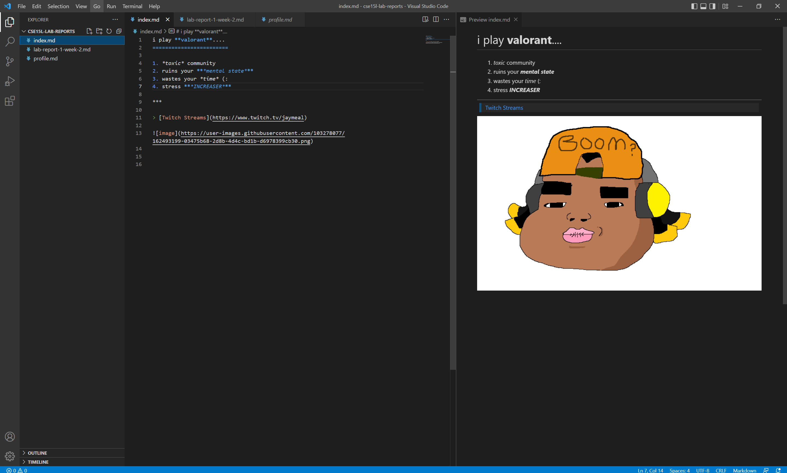
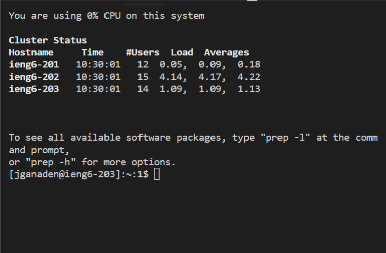

I went to Visual Studio's website and downloaded Visual Studio Code. Upon installing it, you'll be prompted with a few questions like download path and what not. After installing, VSC will open and you can start your projects.

I was able to remotely connect to the server by logging in through the VSCode Terminal. The stuff I saw was not the same as my group, which most likely was caused by different computer components.

I tested out some different commands through the terminal. Specifically, I used "ls -a" which displays files and directories and "pwd" which prints work directory.

I was able to move files over SSH by using SCP. SSH allowed me to log in, while the scp command allowed me to move the files.

I was able to set an SSH key which helped me login really smoothly. This saves time overall, and allows me to jump straight into the work rather than waste time on small details.

With the help of my arrow keys, I was able to navigate through previously used commands. By using the up arrow key, I was able to reuse scp and ssh.