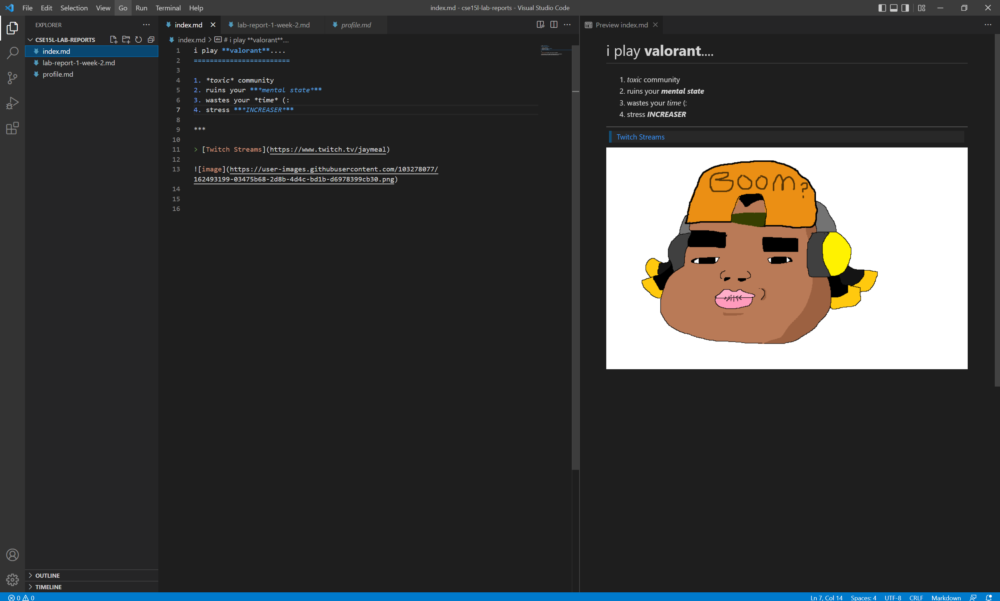
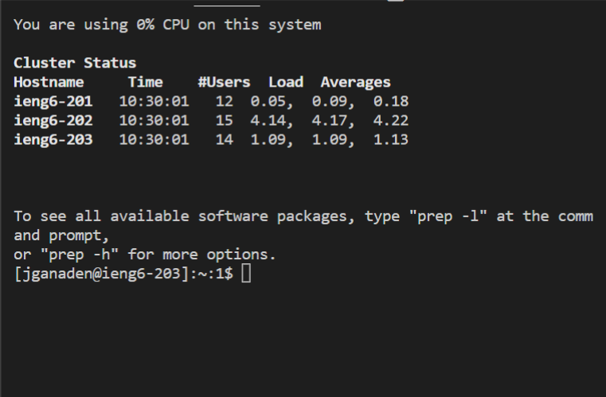
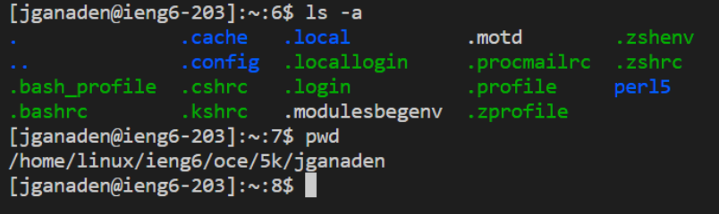

<h1>Bug Fix 1</h1>

LINK TO TEST FILE FOR FAILING INPUT
SHOW OUTPUT OF RUNNING FILE
2-3 SENTENCES OF RELATIONSHIP W/ BUG, SYMPTOM, AND INPUT

<h1>Bug Fix 2</h1>

LINK TO TEST FILE FOR FAILING INPUT
SHOW OUTPUT OF RUNNING FILE
2-3 SENTENCES OF RELATIONSHIP W/ BUG, SYMPTOM, AND INPUT

<h1>Bug Fix 3</h1>

LINK TO TEST FILE FOR FAILING INPUT
SHOW OUTPUT OF RUNNING FILE
2-3 SENTENCES OF RELATIONSHIP W/ BUG, SYMPTOM, AND INPUT
