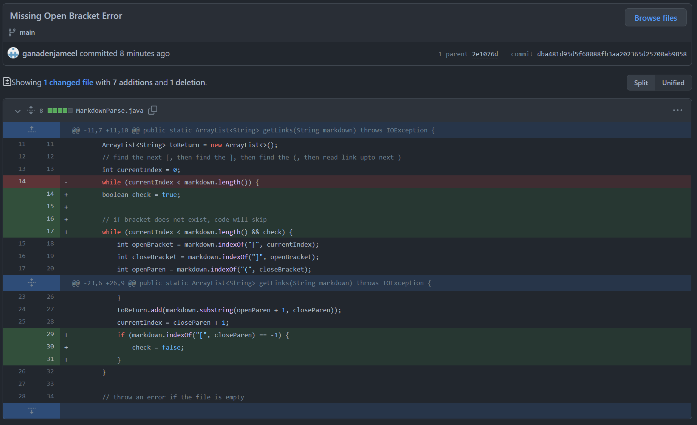

<h1>Bug Fix 1: Empty File</h1>

This is the [file](https://github.com/ganadenjameel/markdown-parser/blob/main/test-file3.md) that caused me to change the code.
SHOW OUTPUT OF RUNNING FILE
2-3 SENTENCES OF RELATIONSHIP W/ BUG, SYMPTOM, AND INPUT

<h1>Bug Fix 2: Missing Open Bracket</h1>

This is the [file](https://github.com/ganadenjameel/markdown-parser/blob/main/test-file2.md) that caused me to edit the code.
SHOW OUTPUT OF RUNNING FILE
2-3 SENTENCES OF RELATIONSHIP W/ BUG, SYMPTOM, AND INPUT

<h1>Bug Fix 3: Images</h1>

This is the [file](https://github.com/ganadenjameel/markdown-parser/blob/main/test-file2.md) that caused me to modify the code.
SHOW OUTPUT OF RUNNING FILE
2-3 SENTENCES OF RELATIONSHIP W/ BUG, SYMPTOM, AND INPUT
