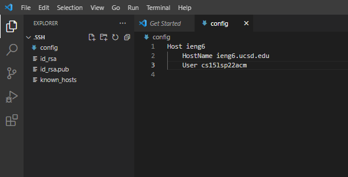
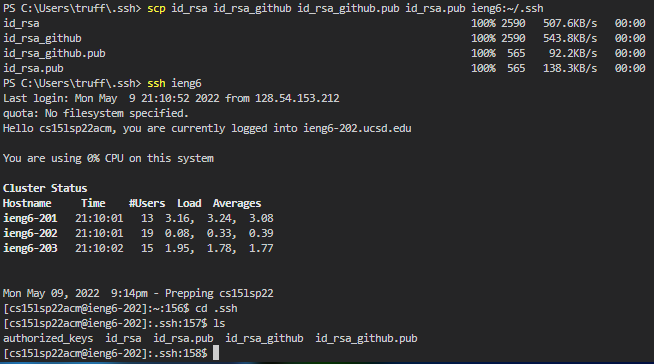
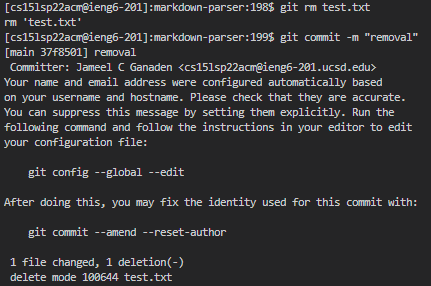
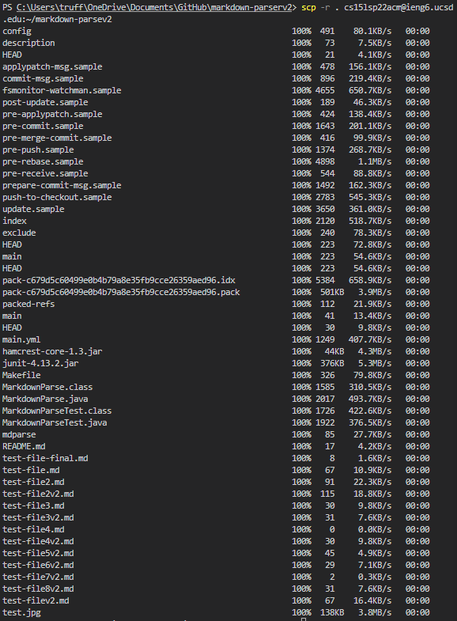
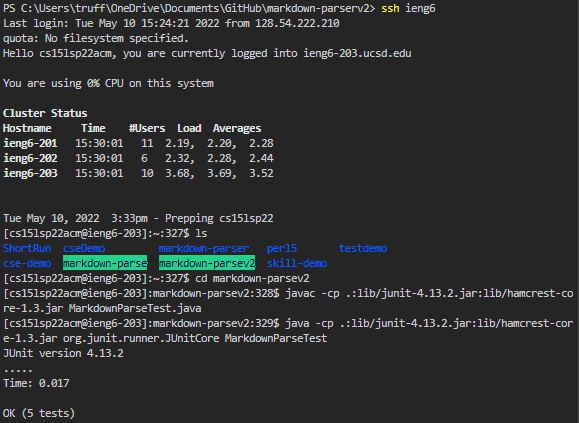
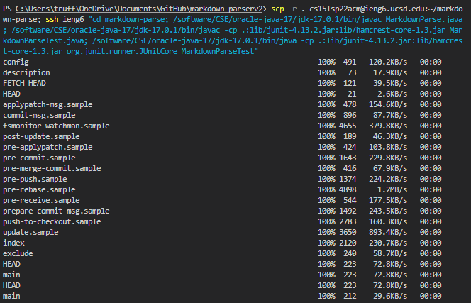
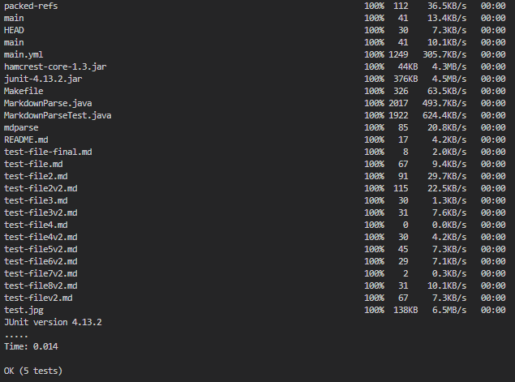

<h1>Streamlining SSH Configuration</h1>

### **Editing Config File**<br>

<br> I opened the **.ssh/config** file through the VS terminal, then I edited the config file through VSCode.

### **SSH Alias Login**<br>

<br> I created an ssh shortcut by adding myself to the host ***ieng6.ucsd.edu***. This allows me to login to the ieng6 machine faster by typing ```ssh ieng6```; a password is no longer necessary to login.

### **Using scp With Alias**<br>

<br> With that same shortcut that I created earlier, I am able to use it when transferring files over to the ieng6 machines. 
<br> The input follows as ```scp [FILE] ieng6```


<h1>Setup Github Access From ieng6</h1>

### **Public Key in Github**<br>

<br> I created a **public SSH key** for my PC and I stored it in my Github account.

### **Private Key in ieng6**<br>

<br> The private key that was made can be seen when I log into the ieng6 machine and ```cd .ssh``` then ```ls``` to show the one of many keys.

### **Running git Commands**<br>

<br> On the ieng6 machine, I removed a file in markdown-parser using ```git rm test.txt```, then I committed the change using ```git commit -m "removal"```.


<h1>Copy Whole Directories With scp -r</h1>

### **Using scp -r .**<br>

<br> By using ```scp -r . cs15lsp22acm@ieng6.ucsd.edu```, I was able to copy my whole markdown-parse directory into my account within the ieng6 machine. This command is useful as it allows me to copy a whole directory rather than individually copying every file using only ```scp```.

### **Running JUnit Tests From Copied Directory**<br>

<br> After copying the whole markdown-parse directory into the ieng6 machine, I logged in using ```ssh ieng6``` and ran the tests with the JUnit javac and java commands that are located in these [CSE15L lecture slides](https://docs.google.com/presentation/d/11OQP-eWU9loJZSvA2M28fJmo8VoYiPrz22MRj1kZVV0/edit#slide=id.g122651cca6b_0_532) on slide 16.

### **Merging All Steps Into One Line**<br>


<br> Here's an example of me copying the whole markdown-parse directory, logging into the ieng6 machine, and running the JUnit tests all in one line. Although there were a few problems when coming across the normal structure of typing ```javac``` and ```java```, I was still able to make it work through the help of this [piazza post](https://piazza.com/class/l0lgl3r7ph370k?cid=444).

> COMMANDS IN 1 LINE:<br>
scp -r . cs15lsp22acm@ieng6.ucsd.edu:~/markdown-parse; ssh ieng6 "cd markdown-parse; /software/CSE/oracle-java-17/jdk-17.0.1/bin/javac MarkdownParse.java; /software/CSE/oracle-java-17/jdk-17.0.1/bin/javac -cp .:lib/junit-4.13.2.jar:lib/hamcrest-core-1.3.jar MarkdownParseTest.java; /software/CSE/oracle-java-17/jdk-17.0.1/bin/java -cp .:lib/junit-4.13.2.jar:lib/hamcrest-core-1.3.jar org.junit.runner.JUnitCore MarkdownParseTest" 