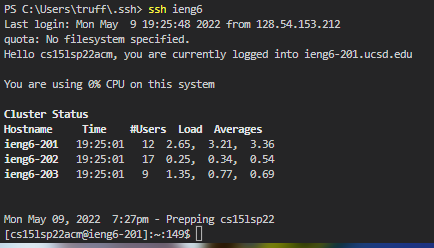
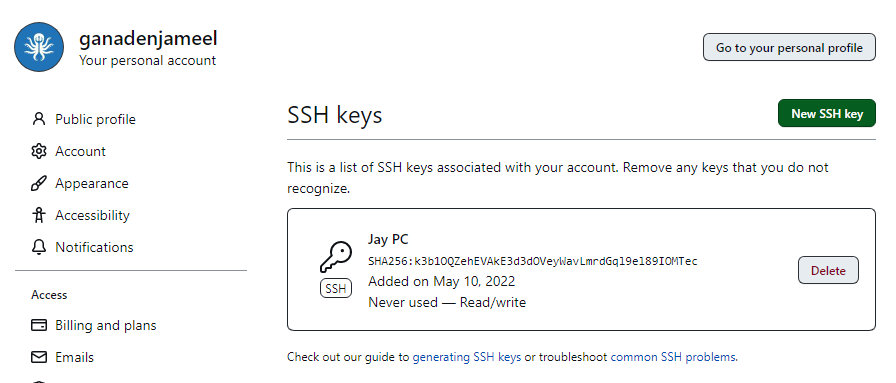

<h1>Streamlining SSH Configuration</h1>


<br> I opened the **.ssh/config** file through the VS terminal, then I edited the config file through VSCode.


<br> I created an ssh shortcut by adding myself to the host ***ieng6.ucsd.edu***. This allows me to login to the ieng6 machine faster by typing ```ssh ieng6```; a password is no longer necessary to login.


<br> With that same shortcut that I created earlier, I am able to use it when transferring files over to the ieng6 machines. 
<br> The input follows as "scp [FILE] ```ieng6```"


<h1>Setup Github Access From ieng6</h1>


<br> I created a **public SSH key** for my PC and I stored it in my Github account.


<br> The private key that was made can be seen when I log into the ieng6 machine and ```cd .ssh``` then ```ls``` to show the one of many keys.


Show where the public key you made is stored on Github and in your user account (screenshot).<br>
Show where the private key you made is stored on your user account (but not its contents) as a screenshot.<br>
Show running git commands to commit and push a change to Github while logged into your ieng6 account.<br>
Show a link for the resulting commit.<br>


<h1>Copy Whole Directories With scp -r</h1>


Show copying your whole markdown-parse directory to your ieng6 account.<br>
Show logging into your ieng6 account after doing this and compiling and running the tests for your repository.<br>
Show (like in the last step of the first lab) combining scp, ;, and ssh to copy the whole directory and run the tests in one line.<br>