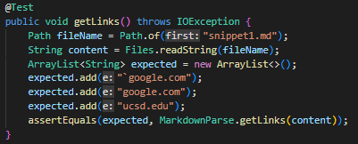
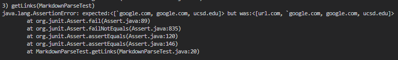
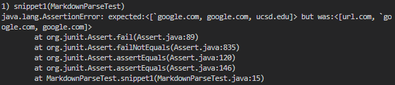
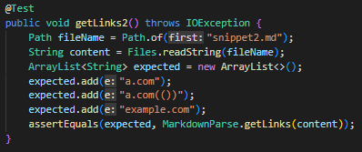
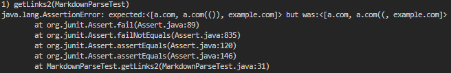
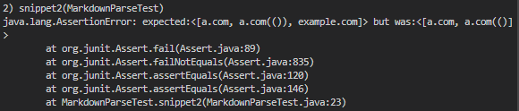
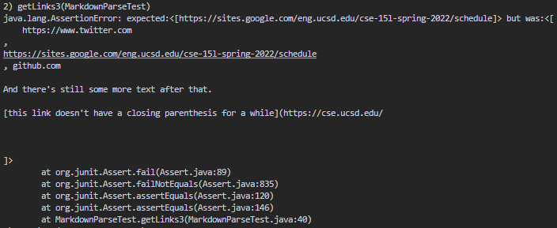
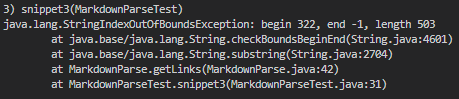

<h1>My Markdown-Parse vs Reviewed Markdown-Parse</h1>

Here is the [link](https://github.com/ganadenjameel/markdown-parser) to ***my*** repository
  Here is the [link](https://github.com/aaronchan32/markdown-parser) to ***reviewed*** repository

## **Test 1**

### Expected Output: [a.com, a.com(()), example.com]  

> `MarkdownParseTest.java` Code for Snippet 1 

> My Repository Failing Test 1 

> Reviewed Repository Failing Test 1 

## **Test 2**

### Expected Output: [https://sites.google.com/eng.ucsd.edu/cse-15l-spring-2022/schedule]  

> `MarkdownParseTest.java` Code for Snippet 2 

> My Repository Failing Test 2 

> Reviewed Repository Failing Test 2 

## **Test 3**

### Expected Output: [`google.com, google.com, ucsd.edu]  

> `MarkdownParseTest.java` Code for Snippet 3 

> My Repository Failing Test 3 

> Reviewed Repository Failing Test 3 

