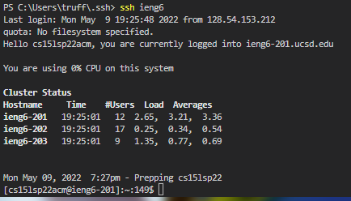

<h1>My Markdown-Parse Repository</h1>

Here is the [link](https://github.com/ganadenjameel/markdown-parser) to my repository

### **Test 1**



<br> 


<br> With that same shortcut that I created earlier, I am able to use it when transferring files over to the ieng6 machines. 
<br> The input follows as ```scp [FILE] ieng6```


<h1>Reviewed Markdown-Parse Repository</h1>
