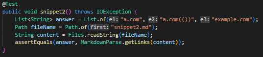
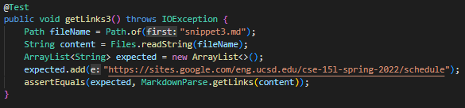
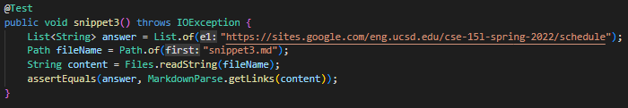

<h1>My Markdown-Parse vs Reviewed Markdown-Parse</h1>

~ Here is the [link](https://github.com/ganadenjameel/markdown-parser) to ***my*** repository  
~ Here is the [link](https://github.com/aaronchan32/markdown-parser) to ***reviewed*** repository

## **Test 1**

### Expected Output: [`google.com, google.com, ucsd.edu]  

> My `MarkdownParseTest.java` Code for Snippet 1 
 
> Reviewed `MarkdownParseTest.java` Code for Snippet 1 

> **My Repository Failing Test 1** 
 
> **Reviewed Repository Failing Test 1** 

I think a small code change could cover a fix for Snippet 1 that deals with inline code with backticks. I believe it will require less than 10 lines of code to make the computer read the code as if there are no backticks at all. This code will run off of an `if statement` that checks for backticks; if a backtick is found, the code will skip over by 1 string index and continue processing the code.

 

## **Test 2**

### Expected Output: [a.com, a.com(()), example.com]  

> My `MarkdownParseTest.java` Code for Snippet 2 
 
> Reviewed `MarkdownParseTest.java` Code for Snippet 2 

> **My Repository Failing Test 2** 
 
> **Reviewed Repository Failing Test 2** 

I do not think a small code change could cover a fix for Snippet 2 that deals with nested parentheses, brackets, and escaped brackets. I believe it will require more than 10 lines of code to make the computer process the code and determine which parantheses and brackets should be put together and which ones should be left out. This code will run off of MULTIPLE `if statements` that checks for a set of brackets/parentheses; if they are nested, the outer pair of brackets/parantheses take priority. You would need to do this separately for both, brackets and parantheses, then return both the bracket and paranthesis pairs in **link format**.

 

## **Test 3**

### Expected Output: [https://sites.google.com/eng.ucsd.edu/cse-15l-spring-2022/schedule]  

> My `MarkdownParseTest.java` Code for Snippet 3 
 
> Reviewed `MarkdownParseTest.java` Code for Snippet 3 

> **My Repository Failing Test 3** 
 
> **Reviewed Repository Failing Test 3** 

I do not think a small code change could cover a fix for Snippet 3 that deals with newlines within the bracket and parenthesis pairs. I believe it will require more than 10 lines of code to make the computer process the code and merge new lines to ensure the proper format is followed for a markdown link. This code will run on an `if statement` that checks for new lines inbetween the opening bracket/parenthesis and the closing bracket/parenthesis; if a new line is found, all the contents found in that new line would be sent back to the previous line to follow the proper format for links in markdown. Although the idea may seem simple, merging code from two lines may not be easy, especially if we do NOT need all the content from the new line.
