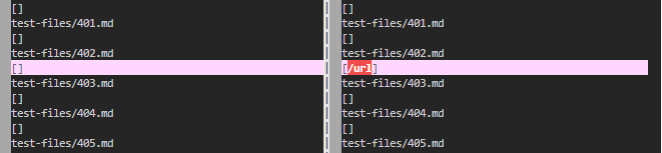
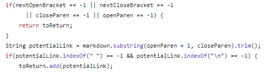
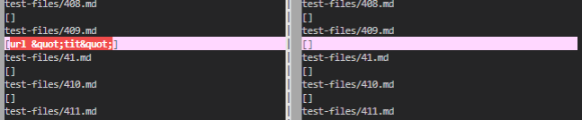
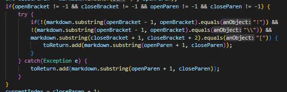

<h1>Using vimdiff on Markdown Parser</h1>

~ Here is the [link](https://github.com/ganadenjameel/markdown-parser) to ***my*** repository  
~ Here is the [link](https://github.com/nidhidhamnani/markdown-parser) to ***compared*** repository  

## **Test 1**

### Expected Output: []  

 

[Link](https://github.com/nidhidhamnani/markdown-parser/blob/main/test-files/402.md) to test file 402 

I found this test file by manually scrolling through the vimdiff and looking for differences in the outputs. My implementation for markdown-parser was `correct` as it did not register any links into the output, unlike the other implementation.

 

The bug in the other implementation must be tied to their specific piece of code in the screenshot above. Similar to my issue in the next test case, their code looks like it was supposed to avoid any incorrect file formats, however the implementation failed to catch the incorrect link in `test file 402`. Either in the first *if statement*, the code did not stop the incorrect link or in the second *if statement*, the code forced the incorrect link to be returned.

 

## **Test 2**

### Expected Output: []  

 

 [Link](https://github.com/nidhidhamnani/markdown-parser/blob/main/test-files/409.md) to test file 409 

Similar to Test 1, I found this test file by scrolling through the vimdiff and looking for differences in the outputs. My implementation for markdown-parser was `incorrect` as it registered some form of url when it was not supposed to, while the other implementation worked.  

 

The bug in my code must be related to the code attached in the screenshot above from my group's markdown-parser implementation. This code is supposed to ensure that incorrect link formats are avoided, however a link was able to be passed through and showed up in the output. Somewhere in that code, the implementation failed to catch the incorrect link format for `test file 409`.